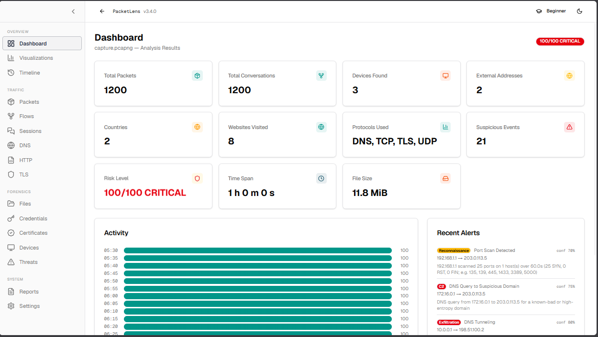

<p align="center">
  <h1 align="center">PacketLens</h1>
  <p align="center"><b>Free, 100% local PCAP analyzer. Drop a PCAP. Get a full security report — entirely on your machine.</b></p>
  <p align="center">
    <a href="https://github.com/simpletarun/Packetlens/releases/tag/v3.3.0"></a>
    <a href="LICENSE"></a>
    <a href="#faq"></a>
  </p>
  <p align="center">
    
  </p>
</p>

---

PacketLens is a **free, 100% local PCAP analyzer** for network forensics and security reporting. Upload a capture and nothing leaves your machine: parsing, flows, sessions, DNS, TCP health, risk scoring (spec 1.3), VoIP (SIP/RTP), offline GeoIP via DB-IP MMDB, investigation graph, world map, and **PDF / HTML / CSV exports** — with no cloud, no account, and no telemetry. Built with Next.js + TypeScript.

---

## 🚀 Quick start

### Requirements

| Requirement | Version / Size |
| --- | --- |
| Node.js | **20+** — [Download Node.js](https://nodejs.org/en/download) (pick the LTS version) |
| RAM | ~1.5–2.5 GB (uploads buffer in memory, 500 MB cap) |
| Disk | ~130 MB (app + one-time GeoIP database download) |
| Browser | Any modern browser (Chrome, Edge, Firefox) |
| OS | Windows, macOS, Linux |

```bash
cd frontend
npm install
npm run dev          # → http://localhost:3456
```

**Production:** `npm run build && npm start`

> **No capture file?** Open `/analysis/mock-demo` to explore the built-in demo dataset.
> **Windows?** Double-click `start-dev.bat` at the repo root.

---

## ✨ Features

| Area | What you get |
| --- | --- |
| **Analysis** | PCAP/PCAPNG up to 500 MB — flows, sessions, DNS, HTTP, TLS, files, credentials, certificates, endpoints, timeline, top talkers |
| **VoIP** | SIP (5060/5061), RTP/RTCP with SSRC tracking, call dialogs by Call-ID |
| **Risk score** | Transparent 0–100 from signature rules (scanning, DNS tunneling, C2 beaconing, exfiltration…) + behavioral metrics. Undecodable captures report **UNKNOWN** — never a false "clean" |
| **Detection** | IOCs and MITRE ATT&CK mappings for every finding |
| **Investigation graph** | Search, type filters, 7 layouts, minimap, context menu, PNG/SVG export |
| **World map** | Fully offline (bundled Natural Earth data) — pins, cluster badges, animated arcs |
| **GeoIP** | Offline DB-IP MMDB by default (auto-install or upload your own); online lookups opt-in |
| **Exports** | Print-ready PDF, standalone HTML, SIEM-friendly CSV (UTF-8 BOM, IPv6-safe) |
| **Privacy** | Beginner mode masks IPs · no analytics · no telemetry |


## 📖 FAQ

<details>
<summary><b>Is my capture sent anywhere?</b></summary>
No. Parsing, analysis, and GeoIP all run locally. The only network touches are an opt-in online lookup and a one-time GeoIP database download.
</details>

<details>
<summary><b>Does it need internet to run?</b></summary>
Only once: `npm install` and the one-time GeoIP database download. After that, everything — including the world map — works fully offline.
</details>

<details>
<summary><b>Is this a Wireshark replacement?</b></summary>
Not exactly. Wireshark is for deep packet inspection; PacketLens is for <i>report generation</i> — drop a capture, get a structured security report and risk score.
</details>

<details>
<summary><b>Does it need Docker or a database?</b></summary>
No. A single Node.js process; history is a JSON file (`~/.packetlens/jobs.json`, last 20 jobs).
</details>

---

## 📚 Docs & status

- [User Guide](docs/PacketLens-User-Guide.html) (HTML + PDF) · [Privacy Policy](frontend/src/app/privacy/page.tsx) · [Workboard](docs/TODO.md)
- Analyzer **3.2.0** · report schema **1.0** · risk spec **1.3** · [Release v3.3.0](https://github.com/simpletarun/Packetlens/releases/tag/v3.3.0)

---

## License

[MIT](LICENSE) © 2026 Tarun
